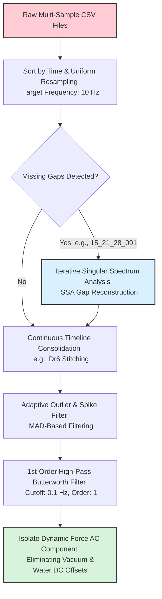
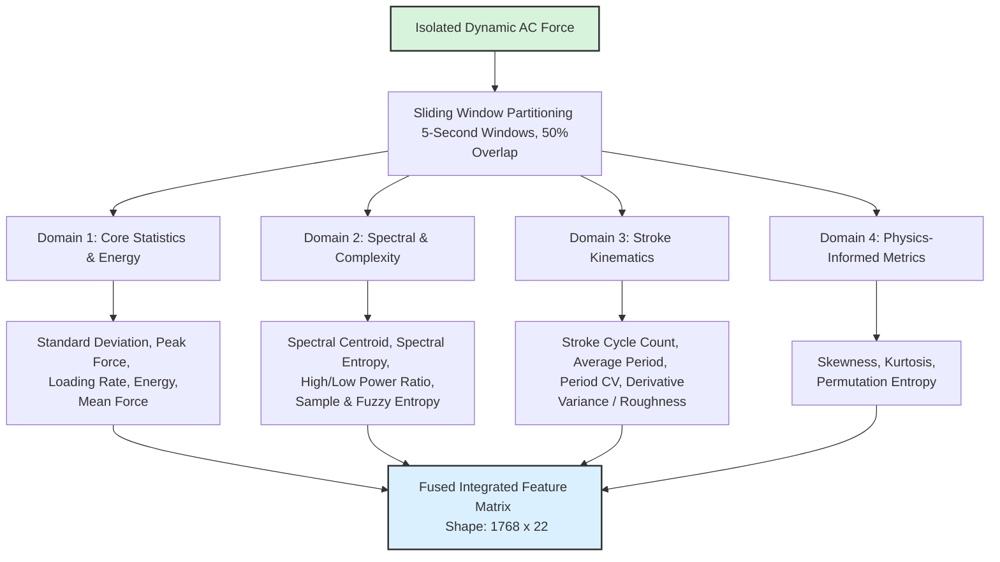
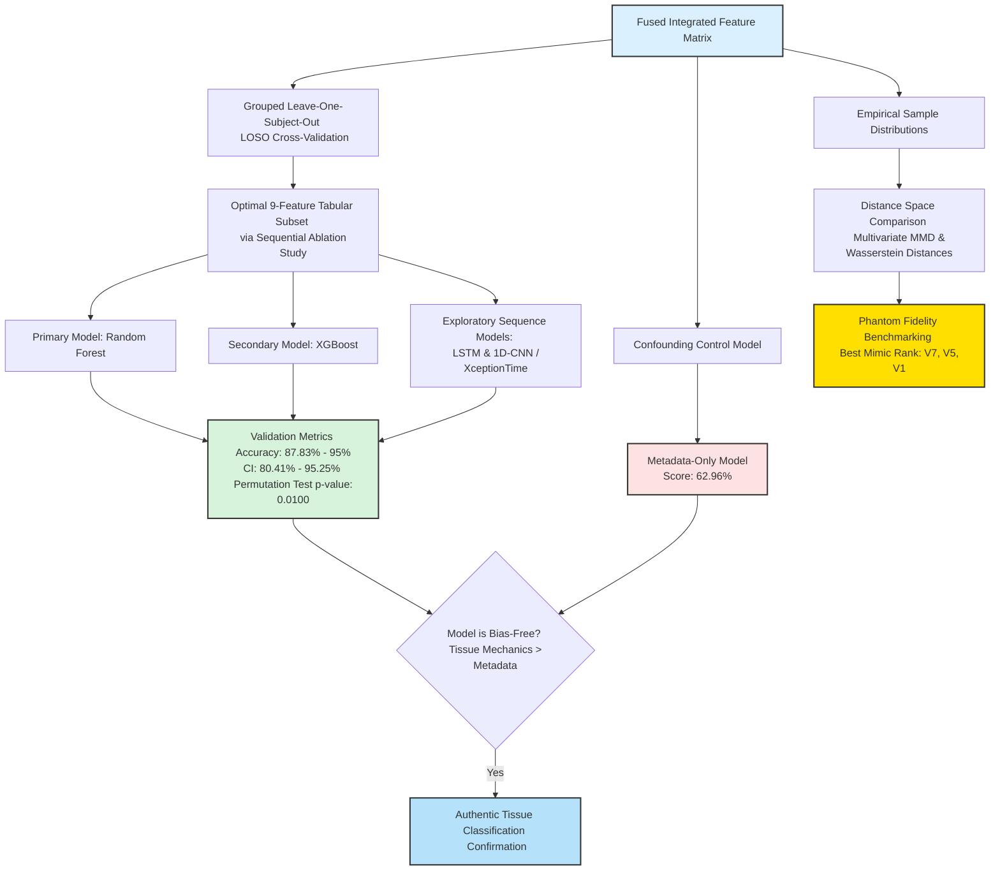

### Modular Flowchart 1: Preprocessing & Signal Reconstruction

This stage focuses on handling the physical signal conditioning, correcting non-uniform sampling, repairing structured gaps, and stripping environmental offsets.

### Modular Flowchart 2: Multi-Domain Sliding-Window Feature Extraction

This stage segments the continuous filtered timeline into overlapping windows to capture localized tissue interaction patterns across four diverse mathematical domains.

### Modular Flowchart 3: Rigorous Validation & Benchmarking Architecture

This stage maps out the rigorous LODO validation, machine state confounding controls, statistical significance profiling, and phantom authenticity ranking.

